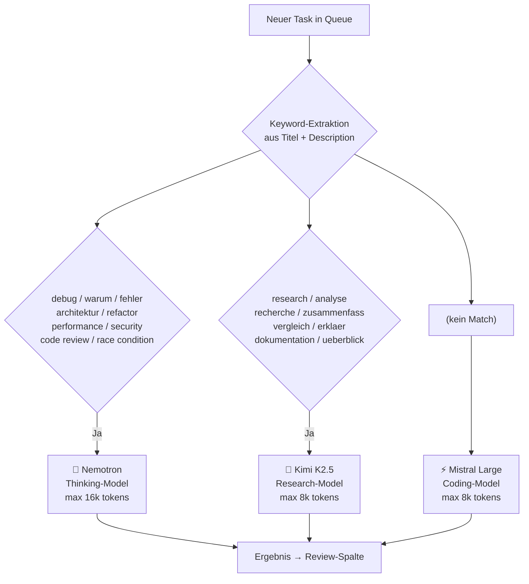
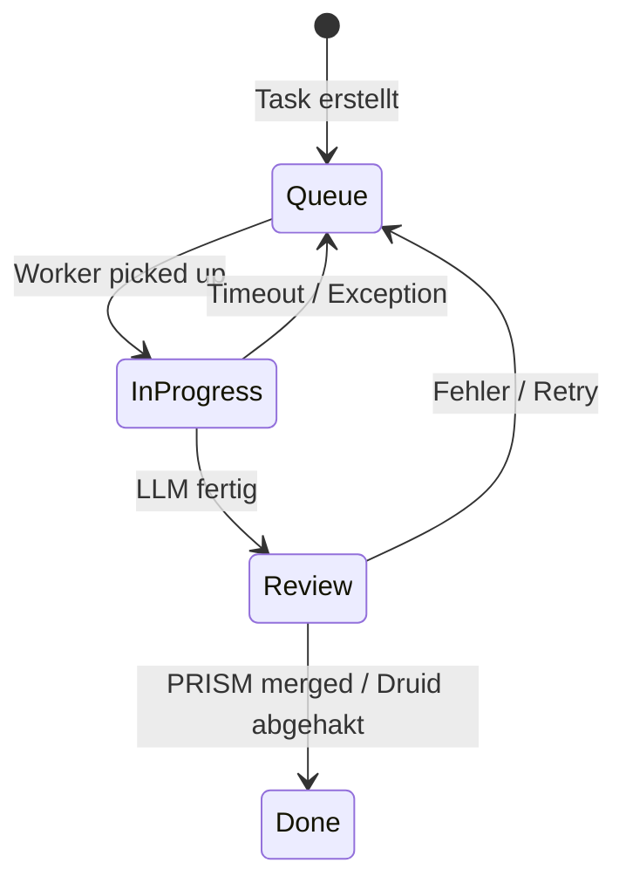
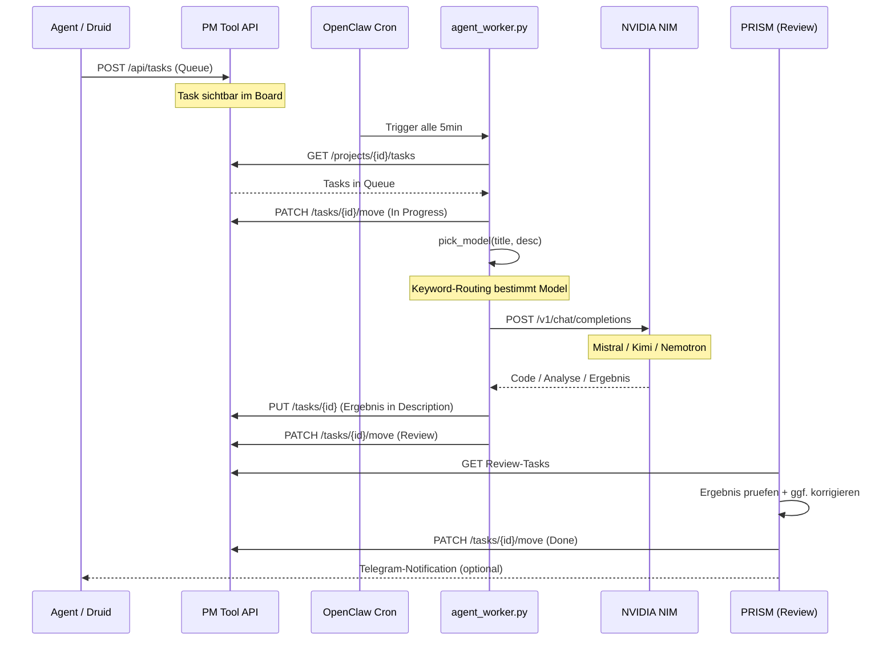

# Architektur — Agent Pipeline × PM Tool

> Wie Agenten ins PM Tool eingebunden sind, wie Tasks geroutet werden,
> und wie neue Agenten angebunden werden können.

---

## 1. Das PM Tool als Message Bus

Das PM Tool (`http://100.115.61.30:8000`) ist der **einzige Kommunikationskanal** zwischen allen Agenten.
Kein Agent spricht direkt mit einem anderen — alles läuft über Tasks.

```
┌──────────────────────────────────────────────────┐
│              PM Tool REST API                    │
│          http://100.115.61.30:8000               │
│                                                  │
│  POST /api/tasks          → Task erstellen       │
│  GET  /api/projects/{id}/tasks  → Tasks lesen    │
│  PATCH /api/tasks/{id}/move     → Status ändern  │
│  PUT  /api/tasks/{id}     → Inhalt updaten       │
└──────────────────────────────────────────────────┘
        ▲               ▲               ▲
        │               │               │
   🔮 PRISM        ⚡ Worker        👤 Druid
  (orchestriert)  (verarbeitet)    (erstellt)
```

**Warum kein direktes Agent-zu-Agent?**
- Keine Abhängigkeit von Agent-Verfügbarkeit
- Jeder Schritt ist im PM Tool sichtbar und nachvollziehbar
- Tasks bleiben erhalten wenn ein Agent abstürzt
- Einfaches Debugging: Task-Status zeigt sofort wo etwas hängt

---

## 2. Task-Routing — wie funktioniert es genau?

### 2.1 Routing-Pipeline

Jeder neue Task durchläuft beim Worker diese Routing-Logik:



### 2.2 Keyword-Tabelle

| Keywords im Titel/Description | → Model | Einsatz |
|---|---|---|
| `debug`, `warum`, `fehler`, `error`, `architektur`, `refactor`, `optimier`, `performance`, `design pattern`, `komplex`, `security`, `race condition`, `code review` | **Nemotron** 🧠 | Komplexe Analyse, Debugging, Architektur-Entscheidungen |
| `research`, `analyse`, `recherche`, `zusammenfass`, `vergleich`, `erklaer`, `dokumentation`, `ueberblick` | **Kimi K2.5** 🌙 | Research, Doku, Vergleiche |
| *(alles andere)* | **Mistral Large** ⚡ | Coding, Feature-Implementierung, Scripts |

### 2.3 Model-Details (alle via NVIDIA NIM)

| Model | ID | API Key | Backend |
|---|---|---|---|
| Mistral Large 3 | `mistralai/mistral-large-3-675b-instruct-2512` | `NIM_KEY_MISTRAL_KIMI` | requests |
| Kimi K2.5 | `moonshotai/kimi-k2.5` | `NIM_KEY_MISTRAL_KIMI` | requests |
| Nemotron Super | `nvidia/nemotron-3-super-120b-a12b` | `NIM_KEY_NEMOTRON` | openai (streaming + thinking) |

**Endpoint:** `https://integrate.api.nvidia.com/v1` (alle drei)

---

## 3. Spalten-Lifecycle



| Spalte | ID | Bedeutung |
|---|---|---|
| **Queue** | `40149a13-...` | Warten auf Bearbeitung |
| **In Progress** | `724ce286-...` | Worker verarbeitet gerade |
| **Review** | `4fa54724-...` | Ergebnis da, PRISM/Druid prüft |
| **Done** | `b4b10fd6-...` | Abgeschlossen |

---

## 4. Neuen Agenten anbinden

### Minimales Setup (3 Schritte)

**Schritt 1 — Task in Queue legen** (von jedem Gerät mit Tailscale-Zugang):

```python
import urllib.request, json

def push_task(title: str, description: str, priority: str = "medium") -> dict:
    """Schreibt einen Task in die Agent Pipeline Queue."""
    payload = {
        "project_id": "c719a8f5-86e8-4620-99d3-05f2c2ee4f37",
        "column_id": "40149a13-a223-466b-b4e3-9b1ede45db8e",  # Queue
        "title": title,
        "description": description,
        "priority": priority,  # low | medium | high | urgent | highlight
    }
    req = urllib.request.Request(
        "http://100.115.61.30:8000/api/tasks",
        data=json.dumps(payload).encode(),
        headers={"Content-Type": "application/json"},
        method="POST"
    )
    with urllib.request.urlopen(req, timeout=10) as r:
        return json.loads(r.read())

# Beispiel:
task = push_task(
    title="GDScript: Enemy AI State Machine",
    description="Implementiere eine State Machine für Enemy-NPCs: IDLE, PATROL, CHASE, ATTACK. Nutze CharacterBody2D."
)
print(f"Task erstellt: {task['id']}")
```

**Schritt 2 — Review-Ergebnisse lesen** (optional, für automatische Weiterverarbeitung):

```python
def get_review_tasks() -> list:
    """Holt alle Tasks die auf Review warten."""
    url = "http://100.115.61.30:8000/api/projects/c719a8f5-86e8-4620-99d3-05f2c2ee4f37/tasks"
    with urllib.request.urlopen(url, timeout=10) as r:
        all_tasks = json.loads(r.read())
    review_col = "4fa54724-4c0e-42a5-a15b-cd8942a3389b"
    return [t for t in all_tasks if t["column_id"] == review_col]
```

**Schritt 3 — Task als Done markieren:**

```python
def mark_done(task_id: str):
    payload = {"column_id": "b4b10fd6-6eae-4239-a951-72926000c921", "position": 0}
    req = urllib.request.Request(
        f"http://100.115.61.30:8000/api/tasks/{task_id}/move",
        data=json.dumps(payload).encode(),
        headers={"Content-Type": "application/json"},
        method="PATCH"
    )
    with urllib.request.urlopen(req, timeout=10) as r:
        return json.loads(r.read())
```

### Via curl (Bash/Shell-Agenten)

```bash
# Task einstellen
curl -s -X POST http://100.115.61.30:8000/api/tasks \
  -H "Content-Type: application/json" \
  -d '{
    "project_id": "c719a8f5-86e8-4620-99d3-05f2c2ee4f37",
    "column_id": "40149a13-a223-466b-b4e3-9b1ede45db8e",
    "title": "[FORGE] Build: Sprite Sheet Cutter",
    "description": "...",
    "priority": "high"
  }'

# Review-Tasks lesen
curl -s "http://100.115.61.30:8000/api/projects/c719a8f5-86e8-4620-99d3-05f2c2ee4f37/tasks" \
  | python3 -c "import json,sys; [print(t['title']) for t in json.loads(sys.stdin.read()) if t['column_id']=='4fa54724-4c0e-42a5-a15b-cd8942a3389b']"
```

---

## 5. Naming-Konventionen für Tasks

Damit PRISM und andere Agenten Tasks richtig zuordnen können:

```
[AGENT] Kurze Beschreibung des Ziels

Beispiele:
[FORGE]  GDScript: Waffe Aktenkoffer implementieren
[KIMI]   Research: Beste Godot 4 Shader für Pixel-Art
[PRISM]  Architektur: Combat-System Refactor Plan
[DRUID]  Feature: Dash-Ability mit Cooldown
```

| Präfix | Erstellt von | Bedeutung |
|---|---|---|
| `[FORGE]` | Forge (Code-Agent) | Benötigt Code-Implementierung |
| `[KIMI]` | Kimi / Pipeline | Research/Analyse-Task |
| `[PRISM]` | PRISM | Koordinations-Task |
| `[DRUID]` | Matthias | Manuell erstellt |
| *(ohne Präfix)* | Pipeline Dispatcher | Standard Coding-Task |

---

## 6. Vollständiger Datenfluss (End-to-End)



---

## 7. Eigenen Worker bauen

Wer einen spezialisierten Worker für ein bestimmtes Projekt will:

```python
from agent_worker import api, move_task, add_result, pick_model, SYSTEM_PROMPT, call_llm

MY_PROJECT    = "DEINE-PROJECT-ID"
MY_COL_QUEUE  = "DEINE-QUEUE-COL-ID"
MY_COL_WIP    = "DEINE-WIP-COL-ID"
MY_COL_REVIEW = "DEINE-REVIEW-COL-ID"

MY_SYSTEM_PROMPT = """Du bist Experte für Godot 4 und GDScript.
Fokus: Spielmechaniken für Meat Machine Cycle.
..."""

def my_worker():
    tasks = api("GET", f"/projects/{MY_PROJECT}/tasks")
    queue = [t for t in tasks if t["column_id"] == MY_COL_QUEUE]
    if not queue:
        return
    task = queue[0]
    move_task(task["id"], MY_COL_WIP)
    model = pick_model(task["title"], task.get("description", ""))
    result, thinking = call_llm(model, MY_SYSTEM_PROMPT, task["description"])
    add_result(task["id"], f"**🤖 {model.upper()}:**\n\n{result}")
    move_task(task["id"], MY_COL_REVIEW)

if __name__ == "__main__":
    my_worker()
```

---

*Clay Machine Games — Agent Pipeline Architektur v1.1 — 2026*
