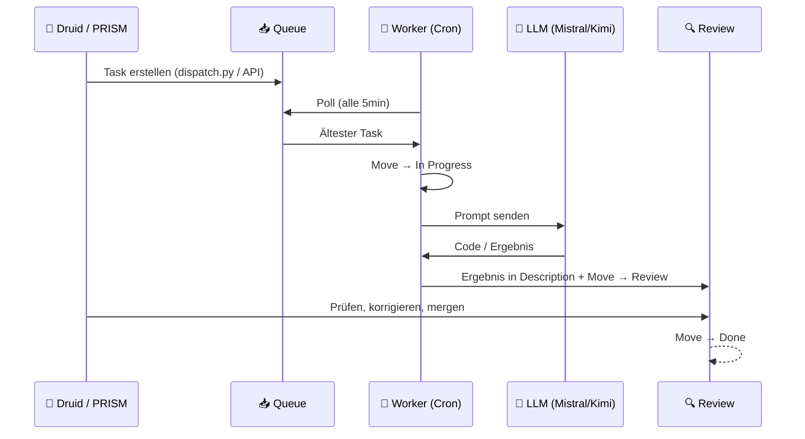

# 🤖 Agent Pipeline — Clay Machine Games

> Multi-Agent Task-Pipeline: Günstige LLMs erledigen Coding-Tasks, teure reviewen.  
> PM Tool als zentraler Message Bus. Cron-getrieben. Vollautomatisch.

---

## Überblick

Die Agent Pipeline delegiert Coding- und Research-Tasks an **günstige LLMs** (Mistral, Kimi) via NVIDIA NIM API. Ergebnisse werden im PM Tool zur Review bereitgestellt. PRISM (Claude) reviewed und korrigiert nur bei Bedarf — **Token-Kosten sinken um 80-90%**.

```
┌─────────────┐     ┌──────────────┐     ┌──────────────┐     ┌──────────┐
│   📥 Queue   │────▶│ ⚙️ In Prog.  │────▶│  🔍 Review   │────▶│  ✅ Done  │
│  (Backlog)   │     │  (LLM läuft) │     │ (PRISM prüft)│     │          │
└─────────────┘     └──────────────┘     └──────────────┘     └──────────┘
       ▲                    │
       │              ┌─────┴─────┐
  Dispatch:           │  NVIDIA   │
  - PRISM             │  NIM API  │
  - Druid             ├───────────┤
  - Cron/Ideation     │ Mistral   │ ← Coding (default)
  - Andere Agenten    │ Kimi K2.5 │ ← Research/Analyse
                      └───────────┘
```

---

## Architektur

### Komponenten

| Komponente | Datei | Beschreibung |
|---|---|---|
| **Worker** | `scripts/agent_worker.py` | Pollt Queue, delegiert an LLM, postet Ergebnis |
| **Dispatcher** | `scripts/agent_dispatch.py` | CLI zum Einstellen neuer Tasks |
| **Config** | `config/config.yml` | IDs, API Keys, Model-Config |
| **Cron** | OpenClaw `agent-worker` | Läuft alle 5 Minuten |

### Task-Lifecycle



### Model-Routing

| Trigger-Keywords | Model | Use Case |
|---|---|---|
| *(default)* | **Mistral Large 3** | Coding, Scripts, Implementierung |
| research, analyse, recherche, zusammenfass | **Kimi K2.5** | Research, Analyse, Zusammenfassungen |

Routing passiert automatisch basierend auf Task-Titel + Description.

---

## Setup

### Voraussetzungen

- Python 3.10+
- PM Tool läuft auf `http://100.115.61.30:8000` (Tailscale)
- NVIDIA NIM API Key ([build.nvidia.com](https://build.nvidia.com))
- OpenClaw (für Cron)

### Installation

```bash
# Repo klonen
git clone https://github.com/AstroGolem224/Agent-Pipeline.git
cd Agent-Pipeline

# Config anpassen
cp config/config.example.yml config/config.yml
# → API Keys + PM Tool URL eintragen

# Scripts in Workspace verlinken (optional)
ln -s $(pwd)/scripts/agent_worker.py ~/.openclaw/workspace/scripts/agent_worker.py
ln -s $(pwd)/scripts/agent_dispatch.py ~/.openclaw/workspace/scripts/agent_dispatch.py
```

### Cron einrichten (OpenClaw)

```bash
openclaw cron add \
  --name agent-worker \
  --cron "*/5 * * * *" \
  --message "Führe aus: python3 scripts/agent_worker.py — Return summary." \
  --model anthropic/claude-sonnet-4-6 \
  --session isolated \
  --no-deliver \
  --light-context \
  --timeout-seconds 120
```

---

## Nutzung

### Task einstellen (CLI)

```bash
python3 scripts/agent_dispatch.py "Titel" "Beschreibung" [priority]

# Beispiele:
python3 scripts/agent_dispatch.py \
  "Python: Rate Limiter Middleware" \
  "Schreibe eine async Rate-Limiter Middleware für FastAPI. Token Bucket, 100 req/min."

python3 scripts/agent_dispatch.py \
  "GDScript: Dash-Ability" \
  "Implementiere eine Dash-Ability für CharacterBody2D. 200px Distanz, 0.2s Dauer, 3s Cooldown."
```

### Task einstellen (API)

```bash
curl -X POST http://100.115.61.30:8000/api/tasks \
  -H "Content-Type: application/json" \
  -d '{
    "project_id": "c719a8f5-86e8-4620-99d3-05f2c2ee4f37",
    "column_id": "40149a13-a223-466b-b4e3-9b1ede45db8e",
    "title": "[AGENT] Task-Beschreibung",
    "description": "Detaillierte Anforderungen...",
    "priority": "medium"
  }'
```

### Task einstellen (von anderen Agenten)

Jeder Agent der Tailscale-Zugang hat kann Tasks einstellen:

```python
import urllib.request, json

def dispatch_task(title, description, priority="medium"):
    payload = {
        "project_id": "c719a8f5-86e8-4620-99d3-05f2c2ee4f37",
        "column_id": "40149a13-a223-466b-b4e3-9b1ede45db8e",
        "title": title,
        "description": description,
        "priority": priority,
    }
    req = urllib.request.Request(
        "http://100.115.61.30:8000/api/tasks",
        data=json.dumps(payload).encode(),
        headers={"Content-Type": "application/json"},
        method="POST"
    )
    with urllib.request.urlopen(req) as r:
        return json.loads(r.read())
```

---

## PM Tool IDs

| Resource | ID |
|---|---|
| **Project** | `c719a8f5-86e8-4620-99d3-05f2c2ee4f37` |
| **Queue** (Backlog) | `40149a13-a223-466b-b4e3-9b1ede45db8e` |
| **In Progress** | `724ce286-8fec-4150-9897-8f042b566fa4` |
| **Review** | `4fa54724-4c0e-42a5-a15b-cd8942a3389b` |
| **Done** | `b4b10fd6-6eae-4239-a951-72926000c921` |

---

## LLM-Kosten vs. PRISM direkt

| Szenario | Model | ~Kosten/Task | Qualität |
|---|---|---|---|
| PRISM direkt (Claude) | Sonnet 4.6 | ~$0.05-0.15 | ⭐⭐⭐⭐⭐ |
| Agent Pipeline | Mistral Large 3 | ~$0.001-0.005 | ⭐⭐⭐⭐ |
| Agent Pipeline | Kimi K2.5 | kostenlos (NIM) | ⭐⭐⭐ |
| **Hybrid** (Pipeline + PRISM Review) | Mistral + Claude | ~$0.01-0.03 | ⭐⭐⭐⭐⭐ |

**Ersparnis: 80-95%** bei vergleichbarer Qualität durch Review-only statt Full-Generation.

---

## Logs

```bash
# Worker-Log
tail -f /tmp/agent-worker.log

# Cron-Status
openclaw cron list
```

---

## Roadmap

- [ ] Retry-Logic mit Backoff bei API-Fehlern
- [ ] Multi-Task-Processing (Batch statt 1 pro Run)
- [ ] File-Context: Relevante Codedateien als Kontext mitschicken
- [ ] Auto-Apply: Review-Tasks automatisch in Codebase mergen (mit Git)
- [ ] Quality-Gate: Automatische Validierung (Syntax-Check, Tests)
- [ ] Agent-Heartbeat: Status-Monitoring im PM Tool
- [ ] Weitere Models: DeepSeek, Llama, Gemma

---

## Lizenz

Intern — Clay Machine Games © 2026
