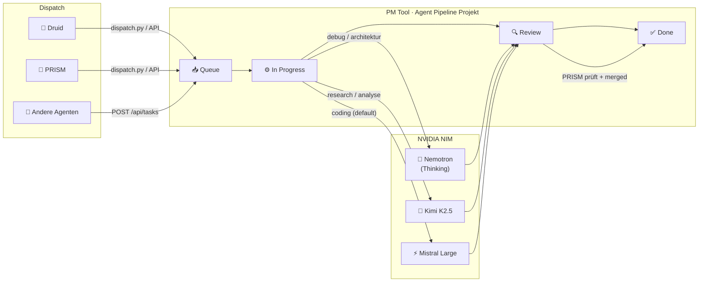
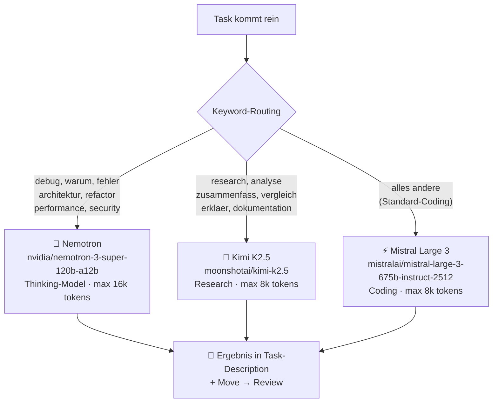
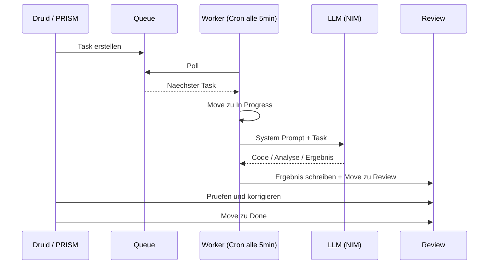

# 🤖 Agent Pipeline — Clay Machine Games

> Multi-Agent Task-Pipeline: Günstige LLMs erledigen Coding-Tasks, teure reviewen.
> PM Tool als zentraler Message Bus. Cron-getrieben. Vollautomatisch.

---

## Überblick

Die Agent Pipeline delegiert Coding- und Research-Tasks an **günstige LLMs** (Nemotron, Kimi, Mistral) via NVIDIA NIM API. Ergebnisse werden im PM Tool zur Review bereitgestellt. PRISM (Claude) reviewed und korrigiert nur bei Bedarf — **Token-Kosten sinken um 80-95%**.



---

## 3-Tier Model-Routing



---

## Task-Lifecycle



---

## Komponenten

| Komponente | Datei | Beschreibung |
|---|---|---|
| **Worker** | `scripts/agent_worker.py` | Pollt Queue, routing, LLM-Call, Ergebnis zurückschreiben |
| **Dispatcher** | `scripts/agent_dispatch.py` | CLI zum Einstellen neuer Tasks |
| **Config** | `config/config.example.yml` | Template für API Keys und PM Tool IDs |
| **Cron** | OpenClaw `agent-worker` | Läuft alle 5 Minuten |

---

## Setup

### Voraussetzungen

- Python 3.10+
- `pip install requests openai`
- PM Tool läuft auf `http://100.115.61.30:8000` (Tailscale)
- NVIDIA NIM API Keys ([build.nvidia.com](https://build.nvidia.com))
- OpenClaw (für Cron)

### Installation

```bash
git clone https://github.com/AstroGolem224/Agent-Pipeline.git
cd Agent-Pipeline

cp config/config.example.yml config/config.yml
# API Keys eintragen

pip install requests openai
```

### Cron (OpenClaw)

```bash
openclaw cron add \
  --name agent-worker \
  --cron "*/5 * * * *" \
  --message "Fuehre aus: python3 /pfad/scripts/agent_worker.py" \
  --model anthropic/claude-sonnet-4-6 \
  --session isolated \
  --no-deliver \
  --light-context \
  --timeout-seconds 120
```

---

## Nutzung

### CLI

```bash
python3 scripts/agent_dispatch.py "Titel" "Beschreibung" [priority]

# Coding → Mistral
python3 scripts/agent_dispatch.py \
  "Python: Rate Limiter" \
  "Async FastAPI Middleware, Token Bucket, 100 req/min"

# Debugging → Nemotron (Thinking)
python3 scripts/agent_dispatch.py \
  "Debug: Warum crasht der Pathfinder bei 50+ Gegnern?" \
  "GDScript Navigation, CharacterBody2D, AStarGrid2D"

# Research → Kimi
python3 scripts/agent_dispatch.py \
  "Recherche: ECS vs OOP in Godot 4" \
  "Vergleiche beide Ansätze für ein Bullet-Hell-Game"
```

### API (von anderen Agenten)

```python
import urllib.request, json

def dispatch_task(title, description, priority="medium"):
    payload = {
        "project_id": "c719a8f5-86e8-4620-99d3-05f2c2ee4f37",
        "column_id": "40149a13-a223-466b-b4e3-9b1ede45db8e",
        "title": title,
        "description": description,
        "priority": priority,
    }
    req = urllib.request.Request(
        "http://100.115.61.30:8000/api/tasks",
        data=json.dumps(payload).encode(),
        headers={"Content-Type": "application/json"},
        method="POST"
    )
    with urllib.request.urlopen(req) as r:
        return json.loads(r.read())
```

---

## PM Tool IDs

| Resource | ID |
|---|---|
| **Project** | `c719a8f5-86e8-4620-99d3-05f2c2ee4f37` |
| **Queue** | `40149a13-a223-466b-b4e3-9b1ede45db8e` |
| **In Progress** | `724ce286-8fec-4150-9897-8f042b566fa4` |
| **Review** | `4fa54724-4c0e-42a5-a15b-cd8942a3389b` |
| **Done** | `b4b10fd6-6eae-4239-a951-72926000c921` |

---

## Kosten-Vergleich

| Szenario | Model | ~Kosten/Task | Qualität |
|---|---|---|---|
| PRISM direkt | Claude Sonnet 4.6 | ~$0.05–0.15 | ⭐⭐⭐⭐⭐ |
| Agent Pipeline | Nemotron (Thinking) | ~$0.005–0.02 | ⭐⭐⭐⭐⭐ |
| Agent Pipeline | Mistral Large 3 | ~$0.001–0.005 | ⭐⭐⭐⭐ |
| Agent Pipeline | Kimi K2.5 | kostenlos (NIM) | ⭐⭐⭐⭐ |
| **Hybrid** | Pipeline + PRISM Review | ~$0.01–0.03 | ⭐⭐⭐⭐⭐ |

**Ersparnis: 80–95%** durch Review-only statt Full-Generation mit Claude.

---

## Logs

```bash
tail -f /tmp/agent-worker.log
openclaw cron list
```

---

## Roadmap

- [ ] Retry-Logic mit Backoff
- [ ] Batch-Processing (mehrere Tasks pro Run)
- [ ] File-Context: Relevante Codedateien mitschicken
- [ ] Auto-Apply: Git-Integration zum direkten Mergen
- [ ] Quality-Gate: Syntax-Check + automatische Tests
- [ ] Weitere Models: DeepSeek, Llama 3, Gemma

---

*Intern — Clay Machine Games © 2026*
