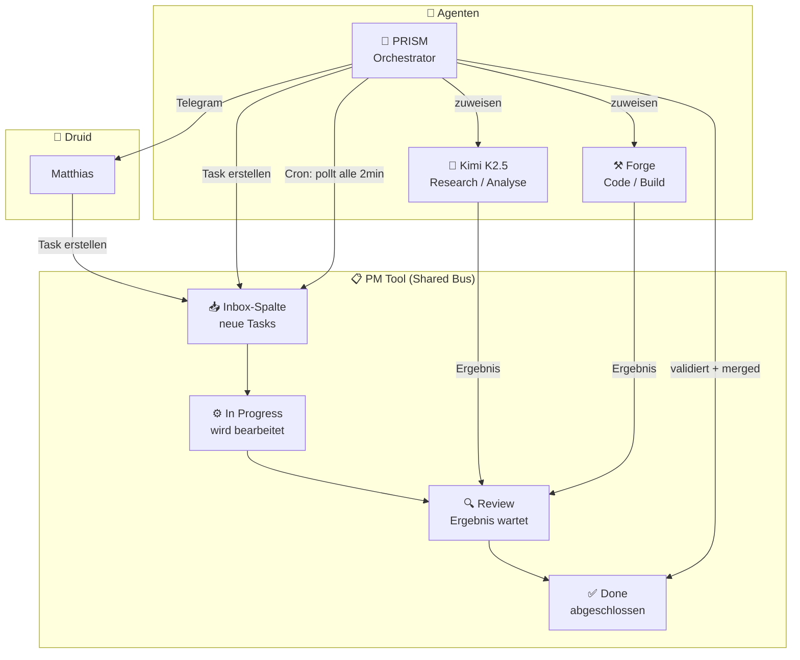
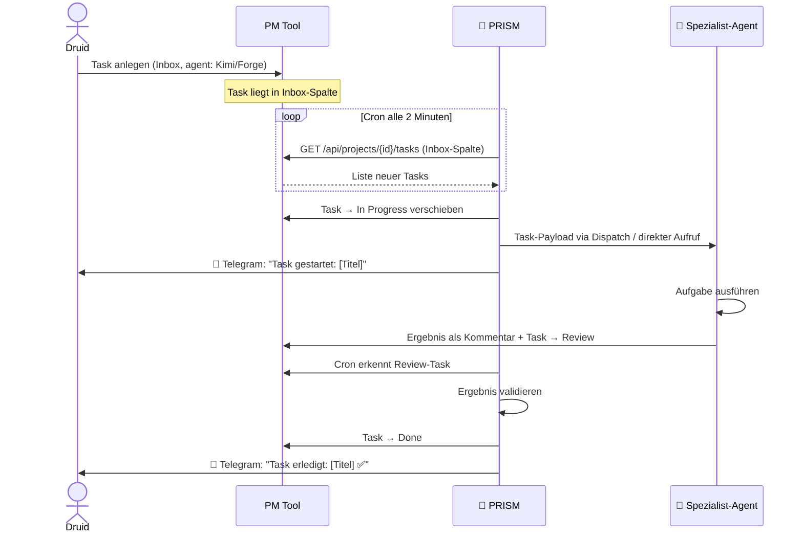
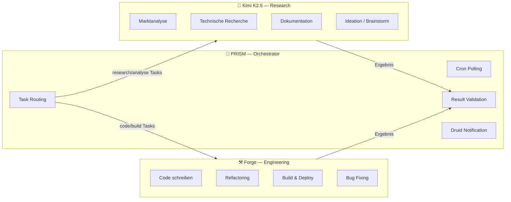
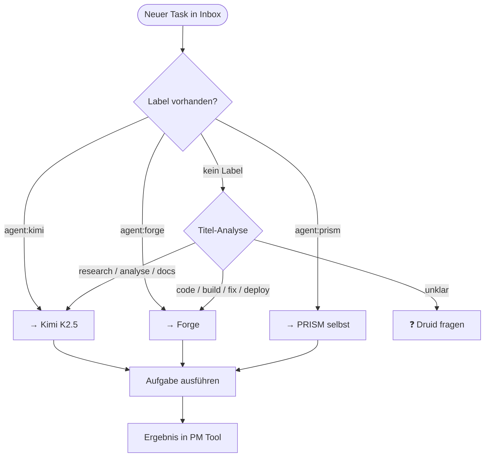
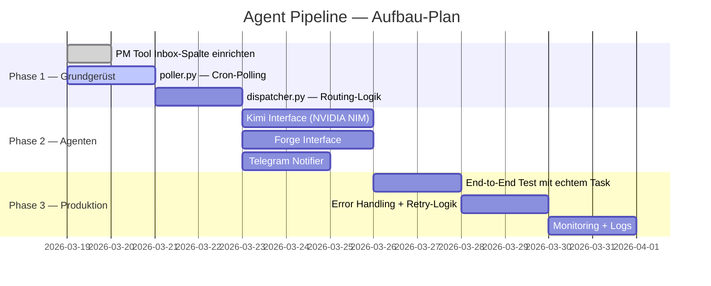

# 🤖 Agent Pipeline — Clay Machine Games

> Eine Multi-Agent-Infrastruktur für autonome Task-Verarbeitung.  
> Agenten kommunizieren über das PM Tool als gemeinsame Aufgabenbasis.

---

## Überblick

Die Agent Pipeline verbindet PRISM, Kimi, Forge und zukünftige Agenten über ein **PM-Tool-zentriertes Task-System**. Statt direkter API-Kommunikation (fehleranfällig) nutzen alle Agenten das PM Tool als **gemeinsamen Nachrichtenbus** — strukturiert, persistent, nachvollziehbar.



---

## Kernprinzipien

| Prinzip | Beschreibung |
|---|---|
| **PM Tool als Bus** | Kein direkter Agent-zu-Agent-API-Call — alles läuft über Tasks |
| **Cron-getrieben** | PRISM pollt alle 2min die Inbox-Spalte auf neue Tasks |
| **Async by default** | Agenten arbeiten unabhängig, PRISM koordiniert |
| **Druid bleibt informiert** | Telegram-Notification bei Task-Start und -Abschluss |
| **Nachvollziehbar** | Jeder Schritt ist im PM Tool sichtbar |

---

## Architektur-Detail

### Task-Lifecycle



### Task-Struktur

Jeder Task im PM Tool folgt diesem Schema:

```yaml
title: "[AgentTag] Kurze Beschreibung"
description: |
  ## Aufgabe
  Konkrete Beschreibung was zu tun ist.

  ## Kontext
  Relevante Hintergrundinformationen.

  ## Erwartetes Ergebnis
  Was soll der Agent liefern?

  ## Output-Format
  Code / Markdown / JSON / etc.

priority: low | medium | high | critical
labels:
  - agent:kimi      # Ziel-Agent
  - type:research   # Task-Typ
  - project:mmc     # Projekt-Kontext
```

### Agent-Rollen



---

## Routing-Logik

PRISM entscheidet anhand von Labels und Titel-Prefix welcher Agent einen Task bekommt:



---

## Projektstruktur (dieses Repo)

```
Agent-Pipeline/
├── README.md               # Diese Datei — Architektur-Überblick
├── docs/
│   ├── ARCHITECTURE.md     # Detaillierte Technische Architektur
│   ├── ROUTING.md          # Routing-Regeln & Agent-Capabilities
│   └── TASK_SCHEMA.md      # Task-Format-Spezifikation
├── scripts/
│   ├── poller.py           # PRISM Cron-Poller (PM Tool → Agent Dispatch)
│   ├── dispatcher.py       # Task an richtigen Agent weiterleiten
│   └── notifier.py         # Telegram-Benachrichtigungen
├── agents/
│   ├── kimi.py             # Kimi K2.5 Interface (NVIDIA NIM)
│   └── forge.py            # Forge Interface
└── config/
    └── config.yml          # PM Tool IDs, API Keys, Routing-Regeln
```

---

## Implementierungs-Roadmap



---

## Nächste Schritte

1. **PM Tool**: Inbox-Spalte im richtigen Projekt anlegen (oder dediziertes "Agent-Tasks" Projekt)
2. **`scripts/poller.py`** schreiben — fragt alle 2min die Inbox-Spalte ab
3. **Labels definieren** — `agent:kimi`, `agent:forge`, `type:research`, etc.
4. **Kimi Interface** — NVIDIA NIM API (bereits in TOOLS.md konfiguriert)
5. **Telegram Notifier** — PRISM postet Start/Ende an Druid

---

*Architektur-Dokument erstellt von PRISM 🔮 — 19.03.2026*
